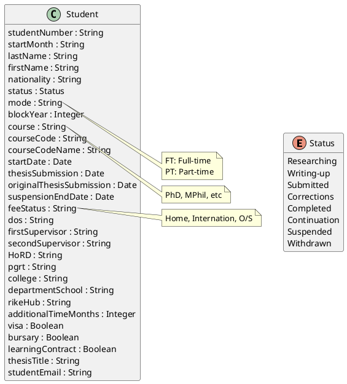

# Week 2 Student Domain Model

## Purpose

This file provides a broad candidate domain model for the Week 2 lab. You are not expected to include every field in your implementation.

Review the Week 2 use cases and decide:

- Which attributes are required by the selected use cases.
- Which attributes are mandatory or optional.
- Which attributes should appear in each view.
- Whether any attribute should be renamed, replaced, or supplemented.
- How expected, original expected, and actual thesis submission dates should be represented.

Keep your revised domain model, use cases, views, forms, and implementation consistent.

## Candidate Domain Model

## Design Notes

- `mode` may use values such as `FT` for full-time and `PT` for part-time.
- `course` may represent a research programme such as PhD or MPhil.
- Review the allowed `Status` values against the use cases before implementation.
- Review whether `thesisSubmission` and `originalThesisSubmission` adequately represent the required thesis-date concepts.
- Supervisor fields are present as candidate attributes but are not required by the core Week 2 use cases.
- Correct or clarify any ambiguous field names before using them in code.
