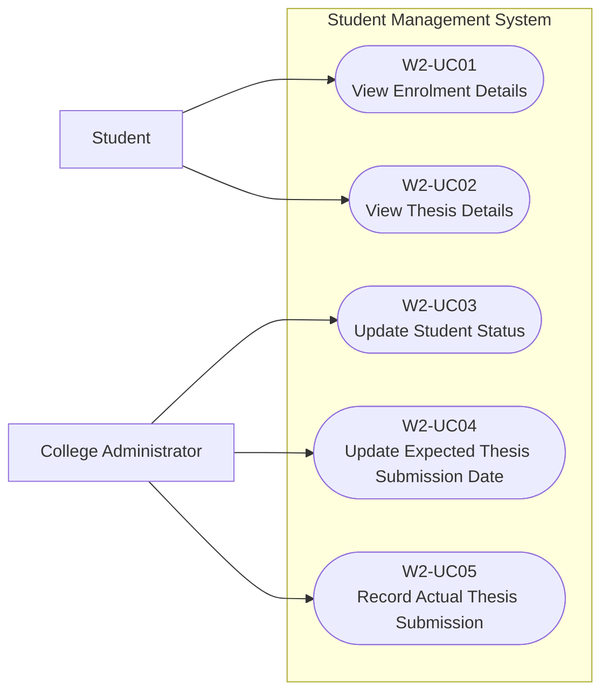

# Week 2 Use-Case Descriptions

## Traceability

These use cases are derived from:

- **US001:** View enrolment and thesis details
- **US004:** Update student status and thesis submission dates

They contribute to:

- **FR02:** Student Record Management
- **FR07:** Student Status Management
- **FR10:** Thesis Submission Management
- **BR12:** Student status values are restricted to defined institutional states

## How to Use This Document

Each use case contains one supplied alternative flow. During the lab, identify additional alternative flows and update the descriptions before or alongside implementation.

The supplied domain model contains candidate fields. Where a use case refers to enrolment, thesis, status, or submission information, decide which domain fields support that behaviour. Do not assume that every supplied field must be implemented.

The Week 2 prototype uses an in-memory collection. Permanent persistence, authentication, role enforcement, and audit history are outside this lab's implementation scope.

## Use-Case Summary

| Use Case ID | Derived From | Use Case | Primary Actor | Goal | Supplied Alternative Flow |
|---|---|---|---|---|---|
| W2-UC01 | US001 | View Enrolment Details | Student | View current enrolment information, including programme, mode of study, start date, and status | Student Not Found |
| W2-UC02 | US001 | View Thesis Details | Student | View thesis information, including title and expected or actual submission dates | Thesis Information Not Available |
| W2-UC03 | US004 | Update Student Status | College Administrator | Change the current academic status of a student | Student Not Found |
| W2-UC04 | US004 | Update Expected Thesis Submission Date | College Administrator | Change the date by which a student is expected to submit their thesis | Student Not Found |
| W2-UC05 | US004 | Record Actual Thesis Submission | College Administrator | Record the actual thesis submission date and update the student status to Submitted | Invalid Submission Date |

## Sequence Diagram

The sequence below shows the five implemented use cases. Student records are read and updated directly in the in-memory collection; successful updates redirect to the relevant details action.

```mermaid
sequenceDiagram
    autonumber
    actor Student
    actor Admin as College Administrator
    participant Browser
    participant Controller as ASP.NET Core MVC (StudentsController)
    participant Students as In-memory student collection
    participant Views as Razor Views

    Note over Browser,Controller: W2-UC01: View Enrolment Details
    Student->>Browser: Request enrolment details(studentNumber)
    Browser->>Controller: GET EnrolmentDetails(studentNumber)
    Controller->>Students: Find matching student
    Students-->>Controller: Student or null
    alt Student found
        Controller->>Views: Render EnrolmentDetails(student)
        Views-->>Controller: HTML with enrolment fields and status
    else Blank number or student not found
        Controller->>Views: Render StudentNotFound
        Views-->>Controller: HTML with not-found message
    end
    Controller-->>Browser: Return rendered page
    Browser-->>Student: Display enrolment details or not-found message

    Note over Browser,Controller: W2-UC02: View Thesis Details
    Student->>Browser: Request thesis details(studentNumber)
    Browser->>Controller: GET ThesisDetails(studentNumber)
    Controller->>Students: Find matching student
    Students-->>Controller: Student or null
    alt Student found
        Controller->>Views: Render ThesisDetails(student)
        alt Thesis information available
            Views-->>Controller: HTML with thesis and submission details
        else No thesis information recorded
            Views-->>Controller: HTML with information-not-available notice
        end
    else Blank number or student not found
        Controller->>Views: Render StudentNotFound
        Views-->>Controller: HTML with not-found message
    end
    Controller-->>Browser: Return rendered page
    Browser-->>Student: Display thesis details or applicable message

    Note over Browser,Controller: W2-UC03: Update Student Status
    Admin->>Browser: Open Edit Status(studentNumber)
    Browser->>Controller: GET EditStatus(studentNumber)
    Controller->>Students: Find matching student
    Students-->>Controller: Student or null
    alt Student found
        Controller->>Views: Render EditStatus(student)
        Views-->>Controller: Status form
    else Blank number or student not found
        Controller->>Views: Render StudentNotFound
        Views-->>Controller: HTML with not-found message
    end
    Controller-->>Browser: Return form or not-found page
    Admin->>Browser: Submit new status
    Browser->>Controller: POST EditStatus(studentNumber, status)
    Controller->>Students: Find matching student
    Students-->>Controller: Student or null
    alt Student not found
        Controller->>Views: Render StudentNotFound
        Views-->>Controller: HTML with not-found message
        Controller-->>Browser: Return not-found page
    else Student found, status is unsupported
        Controller->>Views: Render EditStatus(student) with validation error
        Views-->>Controller: Status form with error
        Controller-->>Browser: Return validation form
    else Student found, status is valid
        Controller->>Students: Update Student.Status
        Controller->>Controller: Set success message in TempData
        Controller-->>Browser: Redirect to EnrolmentDetails(studentNumber)
        Browser->>Controller: GET EnrolmentDetails(studentNumber)
        Controller->>Students: Find updated student
        Students-->>Controller: Updated student
        Controller->>Views: Render EnrolmentDetails(updated student)
        Views-->>Controller: HTML with updated status
        Controller-->>Browser: Return rendered page
    end
    Browser-->>Admin: Display result

    Note over Browser,Controller: W2-UC04: Update Expected Thesis Submission Date
    Admin->>Browser: Open Edit Expected Date(studentNumber)
    Browser->>Controller: GET EditExpectedSubmissionDate(studentNumber)
    Controller->>Students: Find matching student
    Students-->>Controller: Student or null
    alt Student found
        Controller->>Views: Render EditExpectedSubmissionDate(student)
        Views-->>Controller: Expected-date form
    else Blank number or student not found
        Controller->>Views: Render StudentNotFound
        Views-->>Controller: HTML with not-found message
    end
    Controller-->>Browser: Return form or not-found page
    Admin->>Browser: Submit expected date
    Browser->>Controller: POST EditExpectedSubmissionDate(studentNumber, date)
    Controller->>Students: Find matching student
    Students-->>Controller: Student or null
    alt Student not found
        Controller->>Views: Render StudentNotFound
        Views-->>Controller: HTML with not-found message
        Controller-->>Browser: Return not-found page
    else Date missing or before enrolment start date
        Controller->>Views: Render date form with validation error
        Views-->>Controller: Date form with error
        Controller-->>Browser: Return validation form
    else Date is valid
        Controller->>Students: Update ExpectedSubmissionDate
        Controller-->>Browser: Redirect to ThesisDetails(studentNumber)
        Browser->>Controller: GET ThesisDetails(studentNumber)
        Controller->>Students: Find updated student
        Students-->>Controller: Updated student
        Controller->>Views: Render ThesisDetails(updated student)
        Views-->>Controller: HTML with updated expected date
        Controller-->>Browser: Return rendered page
    end
    Browser-->>Admin: Display result

    Note over Browser,Controller: W2-UC05: Record Actual Thesis Submission
    Admin->>Browser: Open Record Submission(studentNumber)
    Browser->>Controller: GET RecordSubmission(studentNumber)
    Controller->>Students: Find matching student
    Students-->>Controller: Student or null
    alt Student found
        Controller->>Views: Render RecordSubmission(student)
        Views-->>Controller: Submission form
    else Blank number or student not found
        Controller->>Views: Render StudentNotFound
        Views-->>Controller: HTML with not-found message
    end
    Controller-->>Browser: Return form or not-found page
    Admin->>Browser: Submit actual submission date
    Browser->>Controller: POST RecordSubmission(studentNumber, date)
    Controller->>Students: Find matching student
    Students-->>Controller: Student or null
    alt Student not found
        Controller->>Views: Render StudentNotFound
        Views-->>Controller: HTML with not-found message
        Controller-->>Browser: Return not-found page
    else Date missing or before enrolment start date
        Controller->>Views: Render submission form with validation error
        Views-->>Controller: Submission form with error
        Controller-->>Browser: Return validation form, no fields changed
    else Date is valid
        Controller->>Students: Set ActualSubmissionDate and Status=Submitted
        Note right of Students: Both properties change together.
        Controller-->>Browser: Redirect to ThesisDetails(studentNumber)
        Browser->>Controller: GET ThesisDetails(studentNumber)
        Controller->>Students: Find updated student
        Students-->>Controller: Updated student
        Controller->>Views: Render ThesisDetails(updated student)
        Views-->>Controller: HTML with actual date and Submitted status
        Controller-->>Browser: Return rendered page
    end
    Browser-->>Admin: Display result

    Note over Students: Data is held in process memory and is not persisted after the application stops.
```

## W2-UC01: View Enrolment Details

**Derived From:** US001  
**Primary Actor:** Student

### Goal

View the student's current enrolment information.

### Preconditions

- The student can access the Student Management System.
- The student has a student number.

### Trigger

The student selects **Enrolment Details** and supplies their student number.

### Main Success Scenario

1. The student requests their enrolment details.
2. The system receives the student number.
3. The system searches the in-memory student collection.
4. The system finds the matching student record.
5. The system retrieves the available enrolment information.
6. The system displays:
   - Student number
   - Student name
   - Research programme
   - Mode of study
   - Start date
   - Current student status
7. The student reviews the information.

### Alternative Flow A1: Student Not Found

At Step 4:

1. No student matches the supplied student number.
2. The system displays **Student not found**.
3. The use case ends.

### Postconditions

#### Success

- The student's available enrolment details have been displayed.
- No student information has been changed.

#### Failure

- No student information has been changed.
- A student-not-found message has been displayed.

## W2-UC02: View Thesis Details

**Derived From:** US001  
**Primary Actor:** Student

### Goal

View the student's thesis and submission information.

### Preconditions

- The student can access the Student Management System.
- The student has a student number.

### Trigger

The student selects **Thesis Details** and supplies their student number.

### Main Success Scenario

1. The student requests their thesis details.
2. The system receives the student number.
3. The system searches the in-memory student collection.
4. The system finds the matching student record.
5. The system retrieves the available thesis information.
6. The system displays:
   - Thesis title
   - Expected submission date
   - Actual submission date, if recorded
   - Current student status
7. The student reviews the information.

### Alternative Flow A1: Thesis Information Not Available

At Step 5:

1. The student record exists, but no thesis information has been recorded.
2. The system displays **Thesis information not available**.
3. The use case ends.

### Postconditions

#### Success

- The student's available thesis details have been displayed.
- No student or thesis information has been changed.

#### Failure

- No student or thesis information has been changed.
- A thesis-information-not-available message has been displayed.

## W2-UC03: Update Student Status

**Derived From:** US004  
**Primary Actor:** College Administrator

### Goal

Change the current academic status of a student.

### Preconditions

- The College Administrator can access the Student Management System.
- The College Administrator can access the student status management function.

### Trigger

The College Administrator selects **Edit Student Status**.

### Main Success Scenario

1. The College Administrator supplies a student number.
2. The system searches the in-memory student collection.
3. The system finds the matching student.
4. The system displays the student's current status and the available status values.
5. The College Administrator selects a new status.
6. The College Administrator submits the change.
7. The system updates the student's `Status` property.
8. The system redirects to the student's details page.
9. The system displays the updated status.

### Alternative Flow A1: Student Not Found

At Step 3:

1. No student matches the supplied student number.
2. The system displays **Student not found**.
3. The student's status is not changed.
4. The use case ends.

### Postconditions

#### Success

- The student's status has been updated in the in-memory collection.
- The updated status remains available until the application stops or restarts.

#### Failure

- The student's status remains unchanged.
- A student-not-found message has been displayed.

### Student Review Task

The supplied alternative flow is intentionally incomplete.

Identify at least two additional situations in which the update might not succeed. Document each situation as an additional alternative flow and state its postconditions.

Possible areas to consider include:

- A missing student number
- An invalid student number format
- A missing status
- An unsupported status value
- Selecting the student's existing status

## W2-UC04: Update Expected Thesis Submission Date

**Derived From:** US004  
**Primary Actor:** College Administrator

### Goal

Update the date by which a student is expected to submit their thesis.

### Preconditions

- The College Administrator can access the Student Management System.
- The College Administrator can access the thesis administration function.

### Trigger

The College Administrator selects **Edit Thesis Information**.

### Main Success Scenario

1. The College Administrator supplies a student number.
2. The system searches the in-memory student collection.
3. The system finds the matching student.
4. The system displays the existing expected thesis submission date.
5. The College Administrator enters a new expected submission date.
6. The College Administrator submits the change.
7. The system checks that the supplied value is a valid date.
8. The system updates the student's expected thesis submission date.
9. The system redirects to the student's thesis details page.
10. The system displays the updated date.

### Alternative Flow A1: Student Not Found

At Step 3:

1. No student matches the supplied student number.
2. The system displays **Student not found**.
3. The expected submission date is not changed.
4. The use case ends.

### Postconditions

#### Success

- The expected thesis submission date has been updated in the in-memory collection.
- The revised date remains available until the application stops or restarts.

#### Failure

- The previous expected submission date remains unchanged.
- A student-not-found message has been displayed.

## W2-UC05: Record Actual Thesis Submission

**Derived From:** US004  
**Primary Actor:** College Administrator

### Goal

Record that a student has submitted their thesis and capture the actual submission date.

### Preconditions

- The College Administrator can access the Student Management System.
- The College Administrator can access the thesis submission function.

### Trigger

The College Administrator selects **Record Thesis Submission**.

### Main Success Scenario

1. The College Administrator supplies a student number.
2. The system searches the static in-memory student collection.
3. The system finds the matching student.
4. The system displays the student's current thesis information.
5. The College Administrator enters the actual submission date.
6. The College Administrator submits the change.
7. The system checks that the supplied value is a valid date.
8. The system records the actual submission date on the `Student` object.
9. The system updates the student's status to `Submitted`.
10. The system redirects to the student's thesis details page.
11. The system displays the updated submission information.

### Alternative Flow A1: Invalid Submission Date

At Step 7:

1. The supplied value is not a valid date.
2. The system does not update the actual submission date.
3. The system does not update the student's status.
4. The system redisplays the form with an **Invalid submission date** message.
5. The College Administrator may correct the value and resubmit the form.

### Postconditions

#### Success

- The actual submission date has been recorded on the `Student` object.
- The student's status has been updated to `Submitted`.
- Both changes are available in the in-memory collection.
- The changes remain available until the application stops or restarts.

#### Failure

- The existing actual submission date remains unchanged.
- The student's existing status remains unchanged.
- An invalid-submission-date message has been displayed.

### Student Review Task

The supplied alternative flow is intentionally incomplete.

Identify at least two additional situations in which the thesis submission might not be recorded successfully. Document each situation as an additional alternative flow and state its postconditions.

Possible areas to consider include:

- A missing student number
- An invalid student number format
- A student record that does not exist
- A missing submission date
- A submission date that is in the future
- A submission date that has already been recorded
- A submission date that conflicts with existing thesis information
- A student whose status cannot be changed to `Submitted`

## Cross-Use-Case Design Decisions

Before implementing the use cases, decide:

- Which Student fields are required by each view and update operation.
- How expected and actual thesis submission dates are represented.
- Which status values are allowed.
- How optional information is displayed.
- Which additional validation rules are required.

When you add a validation rule, add or revise the corresponding alternative flow and postconditions.
